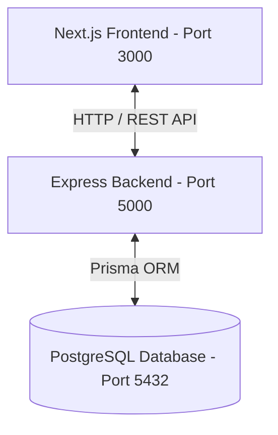
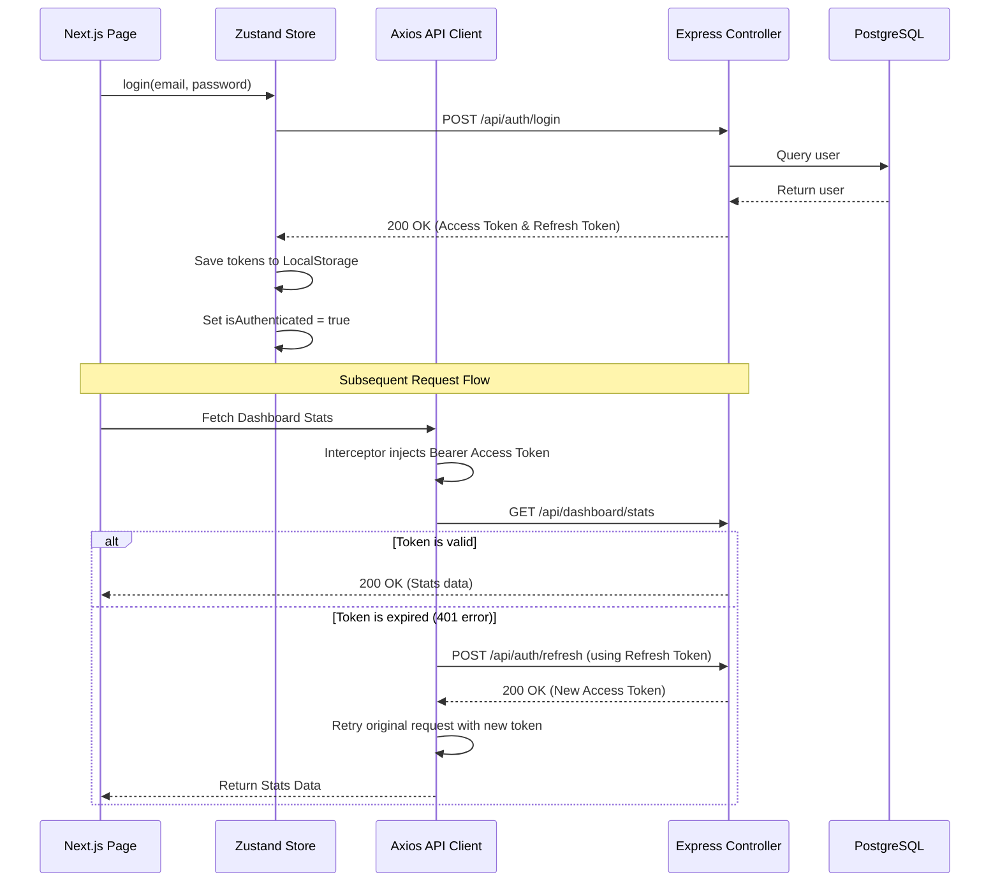

# OdooHack2026 Developer & Architecture Guide

Welcome to **OdooHack2026**. This guide provides a comprehensive overview of the application's architecture, logical data flow, database structure, state management, and setup guidelines to help your team members quickly understand and start building features.

---

## 🏗️ 1. High-Level Architecture

The application is built using a modern **Three-Tier Architecture**:



* **Frontend**: Next.js (App Router, Tailwind CSS, Lucide icons, Framer Motion for premium animations, React Hook Form + Zod for robust client validation, Zustand for global state management).
* **Backend**: Node.js & Express.js (Modular router/controller architecture, JWT-based security with access & refresh tokens, Prisma Client ORM).
* **Database**: PostgreSQL (Prisma-migrated tables).

---

## 📂 2. Directory Structure

Here is the logical structure of the repository:

```
odoohack2026/
│
├── Backend/                 # Express REST API Server
│   ├── config/              # Server configuration (e.g. database client)
│   ├── controllers/         # Business logic for requests (auth, profiles)
│   ├── middleware/          # Security filters (JWT verification, validation checks)
│   ├── prisma/              # ORM configurations
│   │   ├── schema.prisma    # Database definitions (Models & Relationships)
│   │   └── seed.js          # Default database seed scripts
│   ├── routes/              # Express endpoint routing maps
│   ├── validations/         # Request body validation schemas (Zod/custom)
│   ├── .env                 # Backend environment secrets (DB URL, Port, JWT keys)
│   └── server.js            # Express server entry point
│
├── Frontend/                # Next.js App Router Client
│   ├── src/
│   │   ├── app/             # App Router Pages & Layouts
│   │   │   ├── (protected)/ # Route group requiring active authentication
│   │   │   │   ├── dashboard/   # Dashboard workspace
│   │   │   │   ├── profile/     # User profile page
│   │   │   │   └── layout.js    # Protects child pages & renders sidebar/topbar
│   │   │   ├── login/       # Login page
│   │   │   ├── register/    # Signup page
│   │   │   ├── reset-password/ # Password reset request
│   │   │   ├── globals.css  # Global Tailwind styles
│   │   │   └── layout.js    # Root App HTML structure & Toast notifications
│   │   │
│   │   ├── components/      # Shared React components (LeftNav, Topbar, Modals)
│   │   │   └── ui/          # Low-level primitive design elements (Buttons, Input, Card)
│   │   │
│   │   ├── lib/             # Clients & Utilities
│   │   │   ├── api.js       # Axios HTTP client with automatic JWT token refresh
│   │   │   ├── auth.js      # Storage token utilities
│   │   │   └── utils.js     # Class name merging utility (cn)
│   │   │
│   │   └── store/           # Zustand global state (Auth Store)
│   │
│   └── package.json         # Frontend configuration and npm dependencies
│
├── install.bat              # One-click Windows setup & launcher
├── install.sh               # One-click Linux/macOS setup & launcher
├── db-studio.bat            # Windows Database Studio web GUI launcher
├── db-studio.sh             # Linux/macOS Database Studio web GUI launcher
└── .gitignore               # Private config/script exclusion mapping
```

---

## 🔒 3. Authentication & Security Flow

The app uses **Access Token** + **Refresh Token** logic using HTTP Authorization headers.



### Key Security Files
1. **`Frontend/src/lib/api.js`**: Contains Axios request/response interceptors. If an API request fails with `401 Unauthorized` (indicating the Access Token has expired), the interceptor automatically calls `/auth/refresh` using the Refresh Token to obtain a new Access Token, updates storage, and retries the original request transparently without interrupting the user.
2. **`Backend/middleware/auth.middleware.js`**: Validates the Bearer token in the `Authorization` header on protected endpoints.
3. **`Frontend/src/components/ProtectedRoute.jsx`**: Client-side router guard. If a user is not authenticated (`isAuthenticated = false` in Zustand), it redirects them to `/login`.

---

## 🗄️ 4. Database Schema (`schema.prisma`)

We use Prisma ORM with PostgreSQL. The schema has three core models:

```prisma
model User {
  id                 String               @id @default(uuid())
  email              String               @unique
  name               String
  phone              String?
  password           String
  role               UserRole             @default(user)
  createdAt          DateTime             @default(now())
  updatedAt          DateTime             @updatedAt
  refreshTokens      RefreshToken[]
  resetTokens        PasswordResetToken[]
}

model RefreshToken {
  id        String   @id @default(uuid())
  token     String   @unique
  userId    String
  user      User     @relation(fields: [userId], references: [id], onDelete: Cascade)
  createdAt DateTime @default(now())
  expiresAt DateTime
}

model PasswordResetToken {
  id        String   @id @default(uuid())
  token     String   @unique
  userId    String
  user      User     @relation(fields: [userId], references: [id], onDelete: Cascade)
  createdAt DateTime @default(now())
  expiresAt DateTime
}

enum UserRole {
  admin
  user
}
```

---

## ⚡ 5. State Management (`Zustand`)

The global client-side state is handled in **`Frontend/src/store/auth.js`**:
* **`user`**: Stores details of the currently logged-in user.
* **`isAuthenticated`**: Boolean representing session status.
* **`login(email, password)`**: Performs login API calls, configures LocalStorage tokens, and updates state.
* **`logout()`**: Destroys backend tokens, clears LocalStorage, and resets state.
* **`fetchUser()`**: Refreshes current profile info from the server.
* Persistence is handled via Zustand's `persist` middleware, saving session flags into `localStorage` so they survive browser refreshes.

---

## 🛠️ 6. How to Build & Run

### Startup Helper Scripts

We provide startup scripts to automate packages setup, schema generation, database synchronization, database seeding, and execution:

* **Windows Setup and Start**:
  Double-click `install.bat` or run:
  ```powershell
  .\install.bat
  ```
* **Linux / macOS Setup and Start**:
  ```bash
  chmod +x install.sh && ./install.sh
  ```
* **Database Viewer / Analytics**:
  Prisma Studio provides a rich dashboard to view and manage tables:
  * Windows: `.\db-studio.bat`
  * Linux: `chmod +x db-studio.sh && ./db-studio.sh`
  * URL: **`http://localhost:5555`**

---

## 🚀 7. Guidelines for Team Members

When adding new features (e.g. adding a new route/database model):
1. **Define Schema**: Add your model in `Backend/prisma/schema.prisma`.
2. **Sync Database**: Run `npx prisma db push` inside `Backend` to update the Postgres tables and regenerate the Prisma Client.
3. **Backend Routes/Controllers**:
   * Create your route in `Backend/routes/`.
   * Create controller handler in `Backend/controllers/`.
   * Register the route in `Backend/server.js`.
4. **Frontend Integration**:
   * Create page folders inside `Frontend/src/app/` (e.g., `src/app/(protected)/my-feature/page.js`).
   * Import `apiClient` from `../../lib/api` to make Axios API calls directly.
